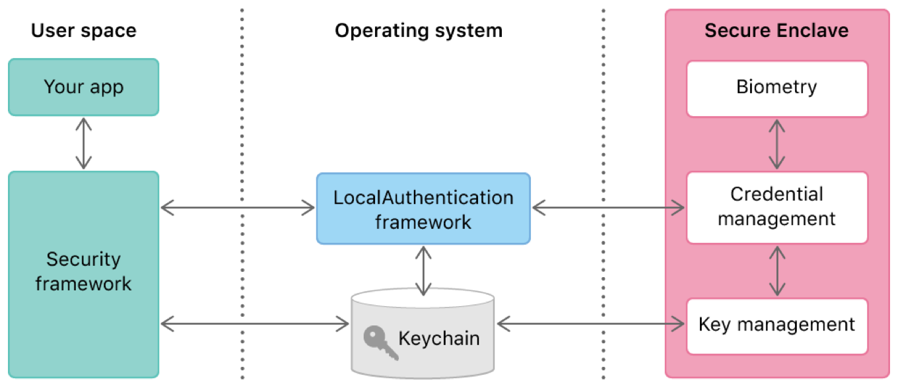

This project covers another research paper where we were tasked to research a
cyber security to determine a research project for our capstone submission.
In my research project titled “A Secure Filesystem: Comparing Operating System
Security Implementation.” I was able to conduct preliminary studies on various
operating systems for their level of security right out of the box as far as
security of operating systems goes. An open educational resource report
submitted in partial fulfillment of the requirements for APSC 486S - Senior
Project ISA University of Hawai’i – West O’ahu.

With Cyber-attacks, malicious code, and Hacking on the rise in this day and
age in the IoT, & WWW reaching corporate and now-a-days even the general
personal computer, it no wonder why the globally concerned public would want
to avoid any type of risk or inconvenience that these various methods of
havoc and chaos could wreak in this volatile open network-based computer
infrastructure. 

This Research paper is intended to provide a report on the Purpose, Methods,
Scope, Results, Conclusions, and Recommendations regarding the categorical
aspect of Device Hardware and Software Security, specifically on the topic
of "Comparing Operating System security implementation". Operating Systems
which include MacOS, Windows, Linux, iOS, & Android, will be test subjects
involved in our study to determine the most protected security framework
foundation out of the box. 

The idea of this project to compare and contrast manufacture installed
security features, encryption methods, firewalls, Anti-virus mitigation
efforts initially intended to protect users/consumers from the beginning,
without any third-party, after-market user interaction/intervention
supplementation, beyond manufacture’s vision.

During this journey we will undergo comparable tests laterally with respect
to each OSs attempt to secure their filesystems integrity put in place by
their developers, etc. Computer OSs will be compared separately from the
comparison of Mobile OSs to level the playing fields accordingly. Results
will be gathered from MacOS, Windows, and Linux with the use of VMware
Fusion running natively on a MacBook Pro laptop computer system. iOS results
will be gathered from an iPhone X, while Android results will be gathered
from an Google Pixel 3a. If an iOS (difficult) image and an Android
(moderate) image is accessible, the examination will also be conducted on
these OSs using VMware Fusion as a test platform.

Another approach for this experiment would be to run iOS directly from
Apple’s Xcode Simulator, and Android directly from Android Studio to provide
an equal virtual machine experience. No benchmarks will be taken, on the
account that only the security side of the OSs technical specifications will
be compared. No human subjects, or additional costs, will be required to
complete this project. The majority of the computer OS images are available
to download for free online and the mobile OS images are included in
emulators like Simulator and Android Studio. The macOS version I will be
using is Mojave; Windows version is Windows 10 Enterprise; Linux will be
Kali; iOS will be 14.4; and Android will be Android 11. 

The objective of this research is to provide a hierarchy of the most
secure to the least secure OS, enabling the consumer to adequately identify
which system meets security standards and which systems could potentially
need additional security methods for their specific requirements.
Understanding the security measures inherent in off-the-shelf hardware/
software OS will greatly impact the decision-making process of a personal
computer user that would like to effectively safeguard their identity, and
overall user performance capabilities in a secure manner knowing that their
chosen OSs manufacture had security as their highest priority.

I learned several interesting factors of security at the end of my studies.
macOS OS currently has no facial recognition capability in the present, or
historically, however, there are rumors that Apple will implement this time
of feature fairly soon. Linux OS does not seem to have any Anti-Virus,
Network sharing, Firewall, Password Manager, Fingerprint, Face, GPS,
Two-Factor Authentication. All of these aforementioned security features must
be manually installed by third-party open-source applications, etc. Windows
OS does not come with Two-Factor Authentication enabled, and requires
post-installation/configuration. iOS and Android do not have dedicated
Network Sharing capability but do have limited user interactive sharing with
various restrictions, unlike normal computer based operating systems. iOS and
Android don’t seem to have Firewall capabilities, and there is limited
documentation on the idea that a Firewall would essentially even be needed in
mobile formats as opposed to computer formats.
