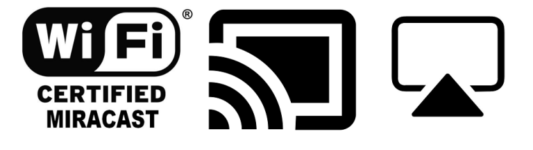

Yet again, another term paper submitted in partial fulfillment of the
requirements for ISA 480C Topics in Information Security and Assurance:
Communications University of Hawai’I West O’ahu, titled “Comparison of Apple
AirPlay and Google Chromecast Streaming Media Services”. 

With many different ways of enabling and utilizing mirroring capabilities more
specifically inherent from the overarching concept of network sharing and the
various implementations consistent with these technologies. It comes to mind
just how these features even work and how flawlessly they seem to transmit and
receive data to recipients that want to distribute an endless array of
communication by mirroring Audio and Video to target devices. In this research,
there will be a comparison of Apple AirPlay and Google Chromecast, along with
the many intricacies that accompany the mirroring concept being used in
everyday internet of things and electronic devices. The ability for this type
of ecosystem as it is to effectively create and maintain a tethered type of
network infrastructure to efficiently and so effortlessly contribute and
collaborate amongst several integrated network devices seem simply intriguing
as to the structure behind the technologically advancement in and of itself. 

The objective of this study is to determine if Airplay & Google Cast are as
secure and what are the full technical specifications of these types of
wireless communication security. My thesis is that AirPlay is certainly
deemed to be more reliable and security driven in respect to security and
privacy of data being transmitted and received to another compatible device
for mirroring integrity. Because Google Chromecast is to some extent
open-source in terms of development, this should prove to be more issue prone
in data confidentiality, and veracity.

Apple AirPlay offers this type of hardening of security illustrates the
consistent priority Apple has with ensuring their patent technologies are
secure and also unidentifiable if any type of information does become
available to malicious attackers of any sort.

The information gathered about the security of the two technologies the first
being AirPlay and the second being Google Chromecast it is very clear that
there was very little information on Apple AirPlay and its security
configurations and integrity, most likely due to the fact that Apple already
by default has extremely high standards of privacy and security, in combination
with very occasional firmware and security updates that persistently patch and
secure their products in general to malicious adversaries alike. Video
streaming requires a higher level of throughput to provide the service
effectively on streaming devices with mirroring technologies such as AirPlay
and Google Chromecast, and thus both mirroring technologies need to be secure
to effectively evade being tampered and relayed to other non-compliant nodes
by malicious intent or actors.
	
This new type of security is highly effective against decryption and comprisal
of data being mirrored or streamed to external target devices whether integrated
in other third-party vendors certified to use AirPlay (2) capabilities or with
Apple products such as an Apple TV device that exclusively can receive
connections related to AirPlay, be it audio, video, etc.

Google Chromecast’s type of authentication method is used much like the similar
AirPlay device to easily ensure the validity of the user and the intended device
of which the instrument is to provide a wireless connection and be verified for
usage. When Google Chromecast is in reset mode, or really not currently
connected to internet, the security surrounding the actual Google Chromecast
Device is totally open to any type to compromise or interference/attack which
could lead to serious security issues as far as modification to the device and
the way it is able to translate, and receive and transmit data that would later
be in motion once the device is reconnected or restarted and ready for use by
the intended users.
